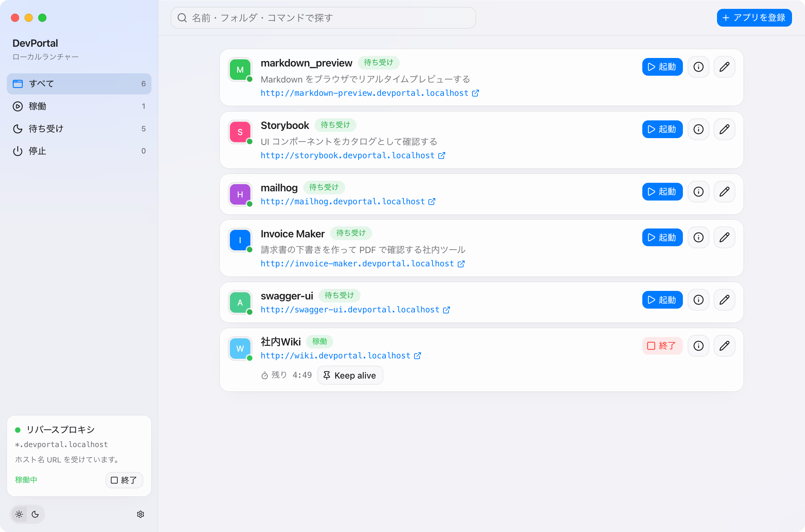
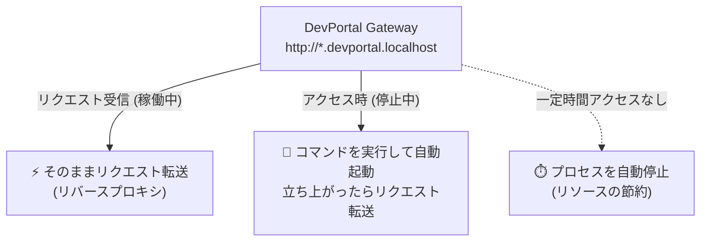

# DevPortal

<p align="center">
  <strong>ローカル開発環境のための、オンデマンド起動ランチャー ＆ リバースプロキシ</strong>
</p>

<p align="center">
  <a href="LICENSE"></a>
  
  
  
  
</p>

<p align="center">
  
</p>

---

## 概要

**DevPortal** は、ローカルで開発している複数の Web アプリや便利ツールを、ターミナルを開くことなく一元管理・操作できる macOS 向けデスクトップアプリです。

登録したローカルドメイン（例: `http://my-tool.devportal.localhost`）にブラウザでアクセスするだけで、**停止中のアプリを自動で検知して起動**し、一定時間アクセスがなければ**自動で終了**して PC リソースを節約します。



---

## 主な特徴

- 🚀 **オンデマンド自動起動（Wake on Request）**
  - ドメインへアクセスがあった時だけプロセスを立ち上げます。毎日常駐させる必要はありません。
- ⏱️ **自動アイドル停止（Idle Stop）**
  - 最後のアクセスから指定時間（例: 10分）経過すると自動でプロセスを安全に終了。
- 🌐 **ゼロコンフィグ・ローカルドメイン**
  - `hosts` ファイルの編集不要。`*.devportal.localhost` を OS が自動でループバック解決します。
- 🧩 **マルチプロセス同時起動**
  - フロントエンド（Next.js / Vite 等）と バックエンド API（Go / Python 等）を 1 まとまりのアプリとして連動起動・終了できます。
- 🔀 **ポート自動解決 & 競合防止**
  - 空いているポートを自動採番し、環境変数（`PORT` や `API_PORT`）経由でプロセスへ自動注入。
- 🎨 **GUI 管理 & YAML 保存**
  - アプリの登録・編集・ログ閲覧・ファビコン表示をすべて直感的な GUI で行え、設定はシンプルな YAML に保存されます。
- ⬆️ **アプリ内アップデート**
  - GitHub Releases を確認し、新しいバージョンがあればダッシュボードとメニューから更新を案内します。

---

## 動作の仕組み

### 1. ドメインとリバースプロキシ
アプリ起動後、画面上部の **「Reverse Proxy」** を有効にするとゲートウェイがポート `80`（または空きポート）で待機します。

```text
http://<アプリ名>.devportal.localhost
```
ブラウザで上記 URL にアクセスすると、DevPortal が間に入り対象アプリへ転送します。

> [!NOTE]
> `*.localhost` ドメインは RFC 6761 により OS レベルで `127.0.0.1` として解決されるため、ネットワーク設定や `/etc/hosts` の変更は一切不要です。

### 2. ポートと変数の注入
アプリ登録時にポート番号をハードコードする必要はありません。コマンドや環境変数に `{port}` や `{backendPort}` プレースホルダーを記述できます。

- コマンド例: `vite --port {port} --host 127.0.0.1`
- 環境変数例: `API_URL=http://127.0.0.1:{backendPort:api}`

---

## 動作要件 (Prerequisites)

開発またはソースコードからビルドする場合の要件です。

- **OS**: macOS 13 (Ventura) 以上 (Apple Silicon / Intel)
- **Go**: 1.25 以上
- **Bun** (推奨) または **Node.js**: 20 以上
- **Wails CLI v3**:
  ```bash
  go install github.com/wailsapp/wails/v3/cmd/wails3@latest
  ```

---

## 開発・ビルド手順

### 1. 依存関係のインストール
```bash
bun install
# または: npm install
```

### 2. 開発サーバーの起動 (Dev Mode)
Go バックエンドと React フロントエンドをホットリロード付きで起動します。
```bash
bun run wails:dev
```

### 3. アプリのビルド・パッケージング

#### 通常のリリースビルド
```bash
bun run wails:build
```

#### macOS アプリ (`.app`) および DMG の作成
```bash
bun run wails:dmg
```
ビルドされた `.app` および `.dmg` は `src-wails/bin/` に出力されます。

> [!TIP]
> 未署名ビルドを初めて開く際に「壊れている」と表示される場合は、ターミナルで隔離属性を解除してください。
> ```bash
> xattr -cr /Applications/DevPortal.app
> ```

### アプリ内アップデート用のリリース資産

Wails の updater は `.dmg` を直接入れ替えません。GitHub Releases には、実行中の OS / アーキテクチャがファイル名に含まれる **`.zip`**（macOS は `.app` ごと）と、その SHA-256 を書いた `SHA256SUMS` を添付してください。

```bash
bun run wails:update-asset
# src-wails/bin/DevPortal-darwin-<arch>.zip
# src-wails/bin/SHA256SUMS
```

タグは `0.1.0` のように先頭の `v` なしで付けます（`v0.1.0` でもリリース時に `v` は落とします）。GitHub Actions の Release workflow がタグをビルドの `currentVersion` と `Info.plist` に埋め込みます。更新確認は起動から数秒後と、以降 6 時間ごとに行い、新しいバージョンがあればダッシュボードのバナーで案内します。メニューの「アップデートを確認…」と設定の同じボタンからは、確認してインストールを開始できます。GitHub API のレート制限を上げたい場合は `DEVPORTAL_GITHUB_TOKEN` か `GITHUB_TOKEN` を渡してください。

---

## 設定ファイル (`apps.yml`)

登録したアプリの設定は、OS 標準のディレクトリに保存されます。

- **保存場所**: `~/Library/Application Support/devportal/apps.yml`

```yaml
gatewayPort: 80
apps:
  - id: "unique-uuid"
    name: my-tool
    description: ローカルで動かすメモ用サーバー
    hostname: my-tool
    folder: /Users/you/repos/my-tool
    command: npm run dev
    portMode: auto
    port: 5173
    portEnv: PORT
    wakeOnRequest: true
    idleStopMin: 15
    env:
      - name: HOST
        value: 127.0.0.1
    backends:
      - name: api
        folder: /Users/you/repos/my-tool/api
        command: go run .
        portMode: auto
        port: 8080
        portEnv: PORT
        appPortEnv: API_PORT
        env:
          - name: DATABASE_URL
            value: postgres://127.0.0.1/app
```

---

## コントリビューション

バグ報告、機能提案、Pull Request を大歓迎しています！
セットアップ手順やテストの実行方法などは [CONTRIBUTING.md](CONTRIBUTING.md) をご確認ください。

---

## ライセンス

このプロジェクトは [MIT License](LICENSE) のもとで公開されています。
